# Avocado e Vestiti

Tienda de ropa en línea donde las marcas publican sus prendas y los clientes
las compran por talla y color. Hecha con **React + TypeScript + Vite** y
**Tailwind CSS**.

Funciona **sin internet ni base de datos**: por defecto trae datos de ejemplo
y guarda todo en el navegador. Si quieres una base de datos real, se conecta a
**Firebase** cambiando una sola variable.

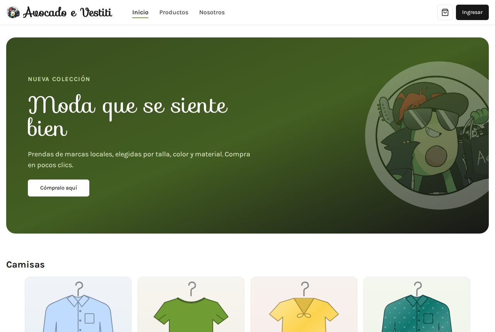

## Contenido

- [Funcionalidades](#funcionalidades)
- [Capturas](#capturas)
- [Inicio rápido](#inicio-rápido)
- [Configuración](#configuración)
- [Arquitectura](#arquitectura)
- [Estructura del proyecto](#estructura-del-proyecto)
- [Rutas](#rutas)
- [Modelo de datos](#modelo-de-datos)
- [Guías rápidas](#guías-rápidas)
- [Convenciones de código](#convenciones-de-código)
- [Solución de problemas](#solución-de-problemas)
- [Tecnologías](#tecnologías)
- [Autor](#autor)

## Funcionalidades

**Para clientes**

- Registro e inicio de sesión con correo (y con Google en modo Firebase).
- Catálogo con búsqueda por nombre y filtro por categoría.
- Página de inicio con secciones por categoría (camisas, pantalones) y por
  material (seda, poliéster, algodón).
- Detalle de cada producto: elegir talla y color y agregarlo al carrito.
- Carrito en un panel lateral: cambiar cantidades, eliminar productos y ver el
  subtotal. Se sincroniza en tiempo real.
- Checkout con formulario de entrega validado y resumen del pedido.
- «Mi cuenta»: editar nombre, dirección y foto de perfil, y ver el historial
  de compras con el estado de cada pedido.

**Para empresas**

- Cada usuario puede registrar una empresa (NIT, banco, contacto).
- Publicar productos con nombre, precio, material, tallas, categorías, colores
  e imagen, y editarlos después.
- Ver los pedidos recibidos y cambiar su estado (pendiente → enviado →
  recibido). El cliente ve el cambio en su historial.
- Si un cliente compra productos de varias empresas, cada una recibe un pedido
  solo con sus productos.

**Técnicas**

- Dos orígenes de datos intercambiables (local o Firebase) detrás de una misma
  interfaz; la interfaz de usuario no sabe cuál se está usando.
- Diseño responsive (celular, tablet y escritorio) y accesible (etiquetas,
  navegación con teclado, textos para lectores de pantalla).
- Validación de formularios con Zod y mensajes en español.
- Código documentado, con tipos estrictos, ESLint y Prettier.

## Capturas

| Tienda                                        | Detalle de producto                         |
| --------------------------------------------- | ------------------------------------------- |
| 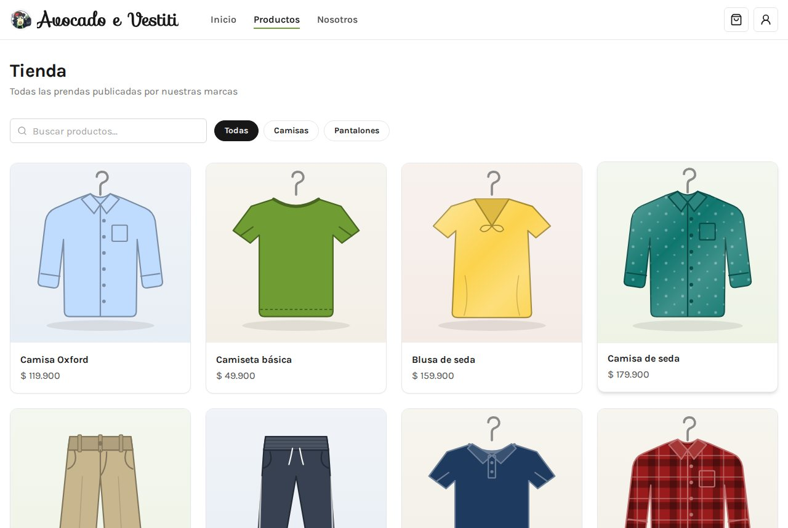           | 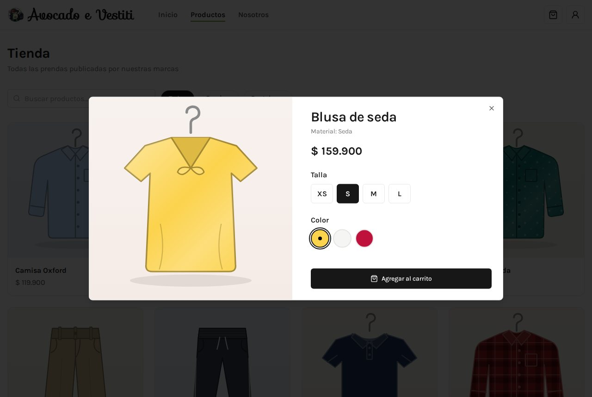     |
| **Carrito**                                   | **Checkout**                                |
| 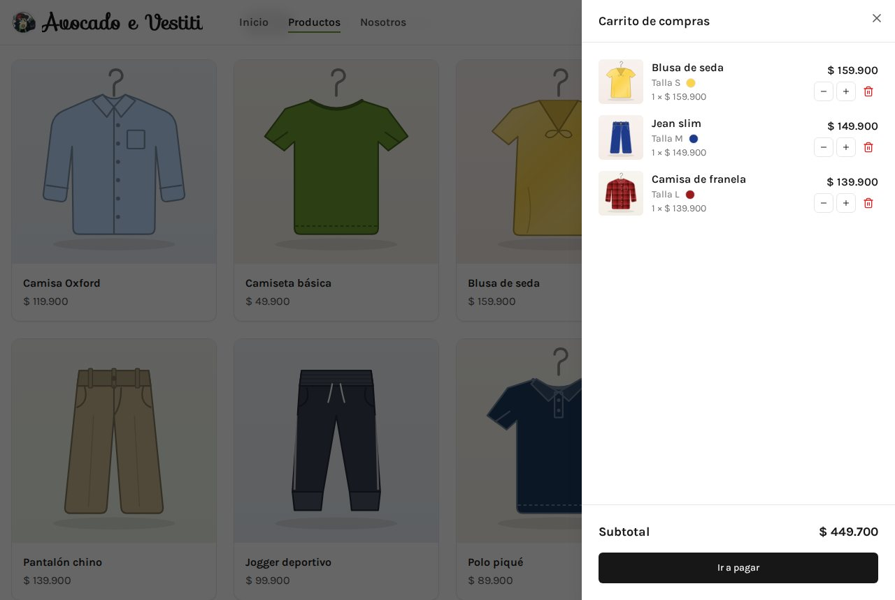         | 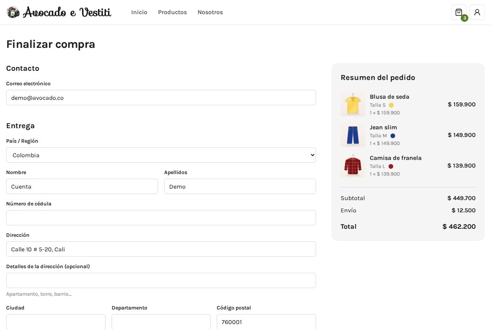     |
| **Pedidos de la empresa**                     | **Editar producto**                         |
| 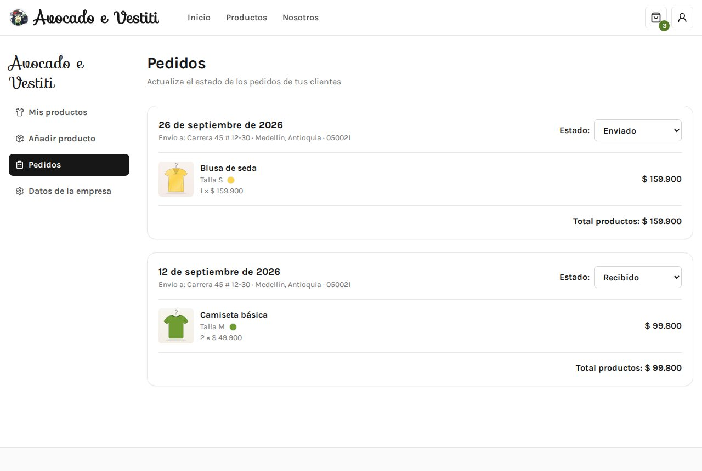 | 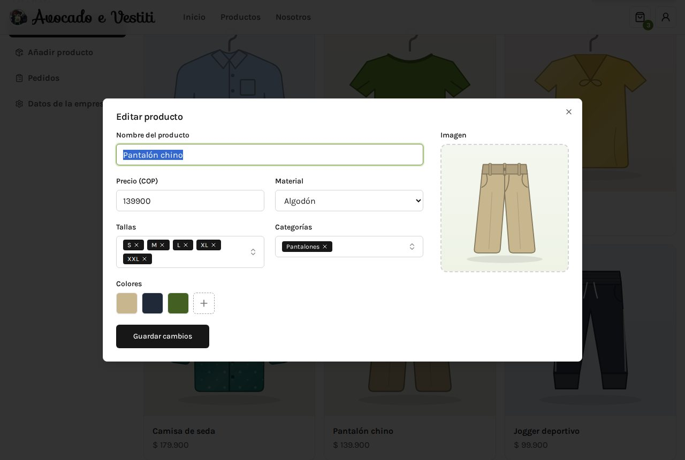 |
| **Mis compras**                               | **Iniciar sesión**                          |
| 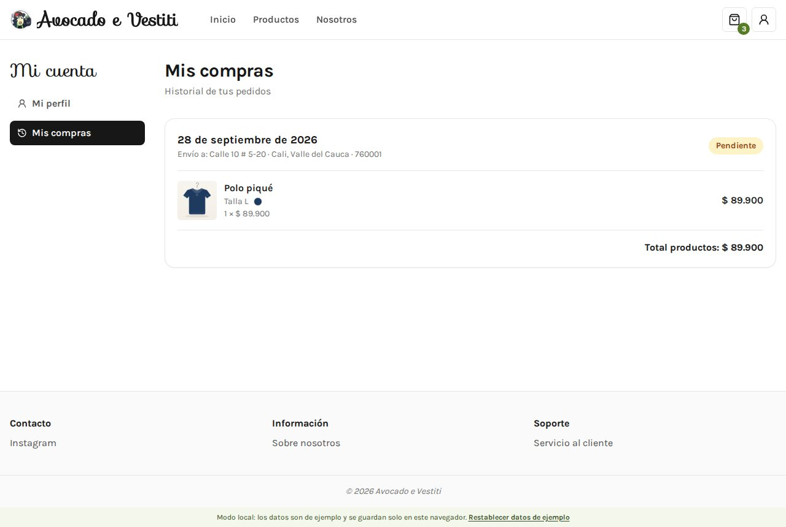     | 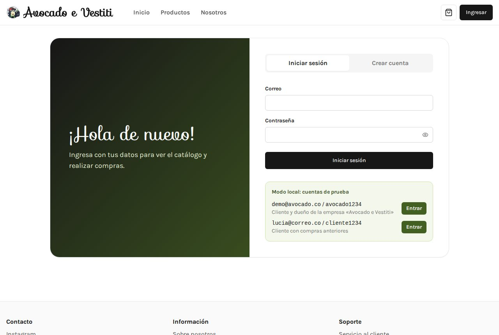           |

En el celular:

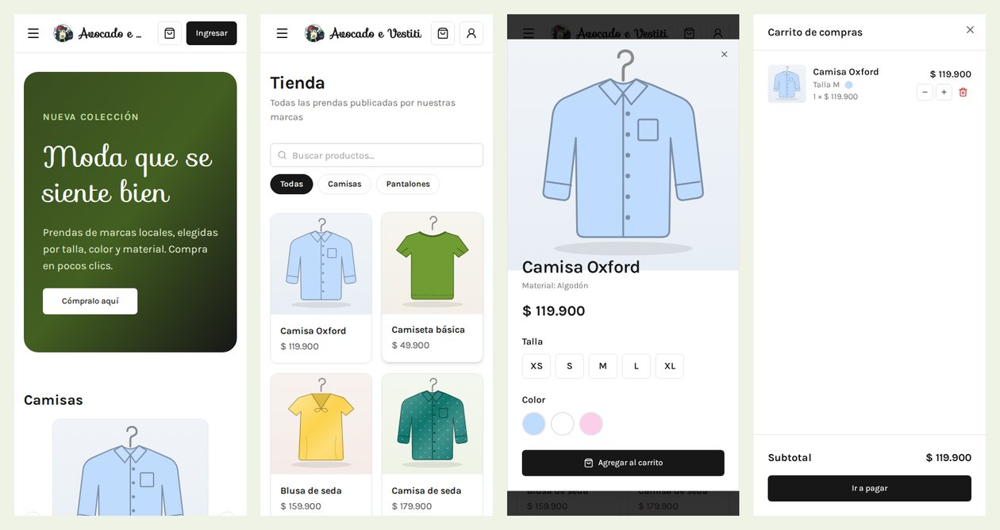

## Inicio rápido

**Requisito:** [Node.js](https://nodejs.org/) 20 o superior (`node -v` para
comprobarlo).

```bash
npm install      # instala las dependencias (solo la primera vez)
npm run dev      # abre la app en http://localhost:5173
```

La app arranca en **modo local** con datos de ejemplo. No hace falta crear
ningún archivo de configuración.

### Cuentas de prueba

| Correo            | Contraseña    | Qué puedes probar                                         |
| ----------------- | ------------- | --------------------------------------------------------- |
| `demo@avocado.co` | `avocado1234` | Comprar y administrar la empresa «Avocado e Vestiti»      |
| `lucia@correo.co` | `cliente1234` | Cliente con compras anteriores (ve los cambios de estado) |

En la pantalla de inicio de sesión hay un botón **Entrar** junto a cada cuenta
para ingresar con un clic. También puedes crear tu propia cuenta y tu propia
empresa.

Para volver a los datos de ejemplo usa el enlace **Restablecer datos de
ejemplo** del pie de página.

> En modo local los datos se guardan solo en ese navegador. Otro navegador u
> otro computador empiezan con los datos de ejemplo.

### Scripts

| Comando                | Qué hace                                                      |
| ---------------------- | ------------------------------------------------------------- |
| `npm run dev`          | Servidor de desarrollo con recarga en caliente                |
| `npm run build`        | Revisa los tipos y genera la versión de producción en `dist/` |
| `npm run preview`      | Sirve la versión de producción (después de `build`)           |
| `npm run typecheck`    | Solo revisa los tipos de TypeScript                           |
| `npm run lint`         | Busca errores y malas prácticas con ESLint                    |
| `npm run format`       | Formatea todo el código con Prettier                          |
| `npm run format:check` | Comprueba el formato sin modificar archivos                   |

## Configuración

La configuración se hace con un archivo `.env` en la raíz (cópialo desde
`.env.example`; en Windows: `copy .env.example .env`). **Es opcional**: sin él,
la app usa el modo local.

| Variable                                                                                                                                                                             | Valores              | Descripción                                      |
| ------------------------------------------------------------------------------------------------------------------------------------------------------------------------------------ | -------------------- | ------------------------------------------------ |
| `VITE_DATA_SOURCE`                                                                                                                                                                   | `local` / `firebase` | Origen de los datos. Por defecto `local`.        |
| `VITE_FIREBASE_API_KEY`                                                                                                                                                              | texto                | Solo en modo Firebase. Igual que las siguientes. |
| `VITE_FIREBASE_AUTH_DOMAIN`, `VITE_FIREBASE_PROJECT_ID`, `VITE_FIREBASE_STORAGE_BUCKET`, `VITE_FIREBASE_MESSAGING_SENDER_ID`, `VITE_FIREBASE_APP_ID`, `VITE_FIREBASE_MEASUREMENT_ID` | texto                | Datos del proyecto de Firebase.                  |

Después de cambiar el `.env` hay que reiniciar `npm run dev`.

### Usar Firebase

1. Crea un proyecto en la [consola de Firebase](https://console.firebase.google.com/).
2. Activa **Authentication** (proveedores «Correo/contraseña» y «Google»),
   **Firestore** y **Storage**.
3. En _Configuración del proyecto → Tus apps_, registra una app web y copia
   sus datos en el `.env`, junto con `VITE_DATA_SOURCE=firebase`.
4. Configura las reglas de seguridad. Como punto de partida para Firestore:

```js
rules_version = '2';
service cloud.firestore {
  match /databases/{db}/documents {
    // Cada usuario solo lee y escribe su perfil, su carrito y sus compras.
    match /users/{uid}/{document=**} {
      allow read, write: if request.auth.uid == uid;
    }
    // Los productos los ve cualquiera; solo los modifica el dueño de la empresa.
    match /products/{id} {
      allow read: if true;
      allow create, update: if request.auth != null
        && get(/databases/$(db)/documents/companies/$(request.resource.data.companyId)).data.userId == request.auth.uid;
    }
    // Las empresas y sus pedidos solo los maneja su dueño.
    match /companies/{companyId} {
      allow read: if true;
      allow create: if request.auth.uid == request.resource.data.userId;
      allow update: if request.auth.uid == resource.data.userId;
      match /orders/{orderId} {
        allow create: if request.auth != null;
        allow read, update: if request.auth.uid ==
          get(/databases/$(db)/documents/companies/$(companyId)).data.userId;
      }
    }
  }
}
```

> Estas reglas son un ejemplo para empezar. Revísalas antes de publicar la
> app. Por ejemplo, la empresa necesita permiso para actualizar el estado de
> la compra en `users/{uid}/purchases`.

## Arquitectura

La app está organizada en capas. Los componentes nunca hablan directamente con
Firebase ni con `localStorage`: todo pasa por `src/core`, que delega en el
**backend** elegido con `VITE_DATA_SOURCE`.

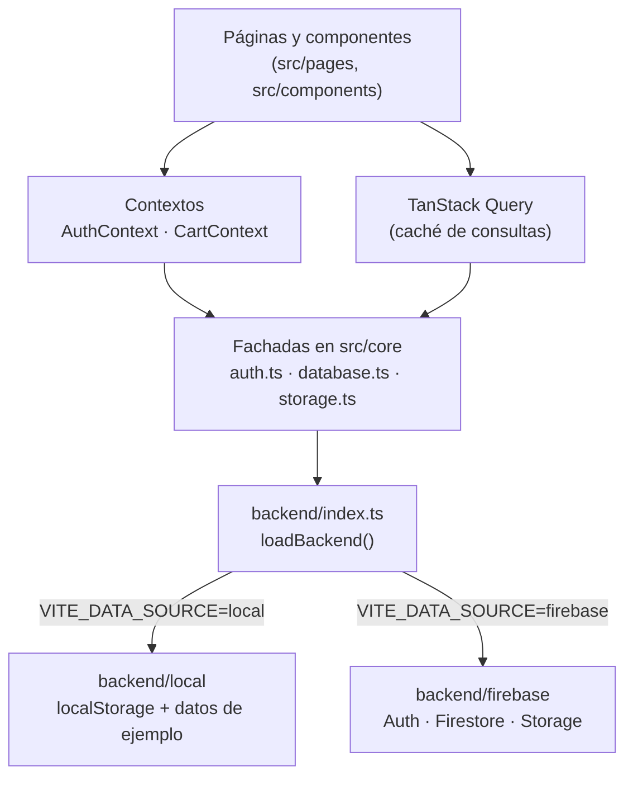

- **Interfaz (`pages`, `components`)**: dibuja la pantalla. Las páginas piden
  datos con `useQuery` (TanStack Query) y los guardan con las funciones de
  `core/database.ts`.
- **Contextos**: estado global que muchas pantallas necesitan: la sesión
  (`useAuth`) y el carrito (`useCart`).
- **Fachadas (`core/auth.ts`, `core/database.ts`, `core/storage.ts`)**:
  funciones con nombres claros (`getProducts`, `purchase`, …) que esperan a
  que el backend cargue y lo llaman.
- **Backends**: implementan la interfaz `Backend` de
  `core/backend/types.ts`. El de Firebase solo se descarga si se usa, así el
  modo local pesa unos 750 kB menos.

### Ejemplo: qué pasa al comprar

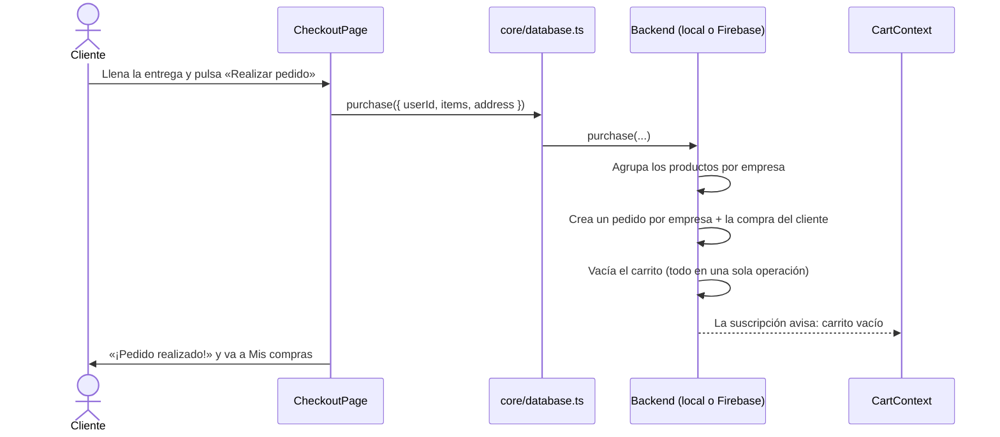

## Estructura del proyecto

```
.
├── docs/capturas/          # Imágenes de este README
├── public/imgs/            # Logo, imagen de respaldo e imágenes de productos de ejemplo
├── src/
│   ├── main.tsx            # Punto de entrada: fuentes, React Query, sesión y router
│   ├── router.tsx          # Todas las rutas
│   ├── App.tsx             # Layout principal (navbar, página, footer, carrito)
│   ├── index.css           # Estilos globales (Tailwind)
│   ├── core/               # Lógica sin interfaz
│   │   ├── auth.ts         #   Registro, inicio y cierre de sesión
│   │   ├── database.ts     #   Usuarios, empresas, productos, carrito y pedidos
│   │   ├── storage.ts      #   Imágenes
│   │   ├── types.ts        #   Tipos de datos (User, Product, Company, …)
│   │   ├── constants.ts    #   Tallas, categorías, materiales, bancos, envío…
│   │   ├── utils.ts        #   Formato de moneda, colores, clases CSS
│   │   └── backend/        #   Origen de los datos
│   │       ├── index.ts    #     Elige y carga el backend
│   │       ├── types.ts    #     Interfaz Backend (contrato común)
│   │       ├── local/      #     Backend local (localStorage)
│   │       │   ├── store.ts          # Lectura/escritura y sesión
│   │       │   ├── seed.ts           # Datos de ejemplo
│   │       │   ├── demo-accounts.ts  # Cuentas de prueba
│   │       │   └── password.ts       # Hash de contraseñas (demo)
│   │       └── firebase/   #     Backend de Firebase
│   ├── context/            # AuthContext (sesión) y CartContext (carrito)
│   ├── hooks/              # useStorageImage, useMyCompany
│   ├── schemas/            # Validaciones de formularios (Zod)
│   ├── components/
│   │   ├── ui/             #   Componentes base (Button, Input, Dialog, Sheet, …)
│   │   ├── layout/         #   Navbar, Footer, DashboardLayout, RequireAuth
│   │   ├── auth/           #   Formularios de inicio de sesión y registro
│   │   ├── checkout/       #   Formulario de entrega y resumen del pedido
│   │   └── *.tsx           #   Componentes de la tienda (ProductCard, CartSheet, …)
│   └── pages/              # Una página por ruta
│       ├── account/        #   «Mi cuenta»: perfil e historial
│       └── business/       #   «Mi empresa»: productos, pedidos y datos
├── .env.example            # Plantilla de configuración
├── CAMBIOS.md              # Historial de cambios
└── package.json
```

Cada archivo empieza con un comentario que explica para qué sirve, y cada
componente, hook y función exportada tiene su documentación (JSDoc), que el
editor muestra al pasar el mouse por encima.

## Rutas

| Ruta                   | Página                        | Requiere sesión |
| ---------------------- | ----------------------------- | :-------------: |
| `/`                    | Inicio                        |                 |
| `/store`               | Tienda                        |                 |
| `/about`               | Sobre nosotros                |                 |
| `/signup`              | Iniciar sesión / crear cuenta |                 |
| `/checkout`            | Finalizar compra              |        ✔        |
| `/account/edit`        | Mi perfil                     |        ✔        |
| `/account/history`     | Mis compras                   |        ✔        |
| `/create-company`      | Crear empresa                 |        ✔        |
| `/company/products`    | Productos de mi empresa       |        ✔        |
| `/company/add-product` | Publicar producto             |        ✔        |
| `/company/orders`      | Pedidos recibidos             |        ✔        |
| `/company/edit`        | Datos de la empresa           |        ✔        |

Si alguien abre una ruta privada sin sesión, se le envía a `/signup` y, al
ingresar, vuelve a la página que quería ver. Las direcciones antiguas
(`/payment`, `/createcompany`) redirigen a las nuevas.

## Modelo de datos

Los tipos están en [`src/core/types.ts`](src/core/types.ts).

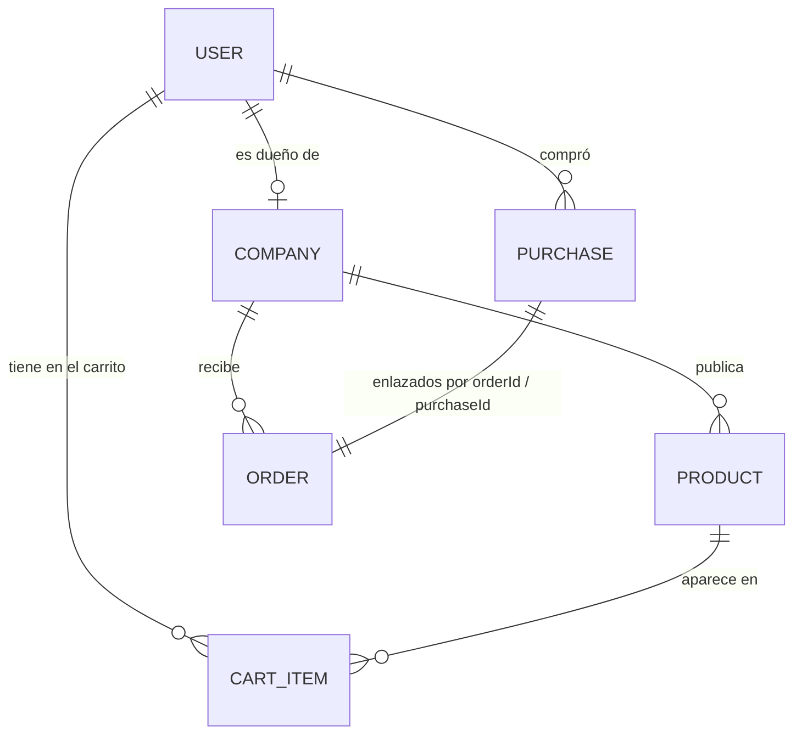

**En Firebase (Firestore):**

```
users/{userId}                     name, email, provider, address, postalcode
  ├── cart/{itemId}                productId, price, quantity, sizes[], colors[]
  └── purchases/{purchaseId}       companyId, orderId, items[], address, state, orderedAt
companies/{companyId}              userId, name, nit, bankType, bankAccount, address, …
  └── orders/{orderId}             userId, purchaseId, items[], address, state, orderedAt
products/{productId}               companyId, name, price, materials, sizes[], categories[], colors[]
```

Imágenes en Storage: `product_images/{productId}` y `profile_images/{userId}`.

**En modo local (`localStorage` del navegador):**

| Clave                | Contenido                                                    |
| -------------------- | ------------------------------------------------------------ |
| `avocado:db:v1`      | Todos los datos en un JSON con la misma estructura de arriba |
| `avocado:session`    | Id del usuario con sesión iniciada                           |
| `avocado:img:<ruta>` | Cada imagen subida, reducida a 800 px (JPEG en base64)       |

Las imágenes de los productos de ejemplo están en `public/imgs/products/`.
Si un producto no tiene imagen se muestra `public/imgs/placeholder-product.svg`.

## Guías rápidas

**Agregar una página nueva**

1. Crea el componente en `src/pages/MiPagina.tsx` (con `export default`).
2. Regístralo en `src/router.tsx`: `{ path: "mi-pagina", element: <MiPagina /> }`.
   Si requiere sesión, ponlo dentro del bloque de `<RequireAuth />`.
3. Si debe aparecer en el menú, agrégalo a `links` en
   `src/components/layout/Navbar.tsx`.

**Agregar una talla, categoría, material o banco**

Edita las listas de `src/core/constants.ts`. Para una categoría nueva agrega
también su carrusel en `src/pages/HomePage.tsx` si quieres que tenga sección
propia en el inicio.

**Agregar un campo a los productos (por ejemplo, «descripción»)**

1. Agrégalo al tipo `Product` en `src/core/types.ts`.
2. Agrégalo a `productFormSchema` en `src/schemas/product.ts`.
3. Agrega el campo en `src/components/ProductForm.tsx` (usa `<Field>` e `<Input>`).
4. Muéstralo donde lo necesites, por ejemplo en `ProductDialog.tsx`.

**Cambiar los colores o las fuentes de la marca**

Los colores `brand-*` y las fuentes están en `tailwind.config.js`. Las fuentes
se incluyen con `@fontsource` en `src/main.tsx`, así funcionan sin internet.

**Cambiar los datos de ejemplo**

Edita `src/core/backend/local/seed.ts` y luego pulsa «Restablecer datos de
ejemplo» en el pie de página para cargarlos.

## Convenciones de código

- **Idioma:** la interfaz, los comentarios y la documentación están en
  español; los nombres de variables y funciones, en inglés.
- **Nombres de archivo:** `PascalCase.tsx` para componentes y páginas,
  `kebab-case.tsx` en `components/ui` (convención de shadcn/ui), `camelCase.ts`
  para el resto.
- **Estilos:** clases de Tailwind directamente en el JSX. Para combinar
  clases condicionales usa `cn()` de `src/core/utils.ts`.
- **Datos:** los componentes usan las funciones de `core/database.ts`, nunca
  el backend directamente. Para leer datos usa `useQuery` con una clave que
  incluya los ids (ej: `["orders", companyId]`) y, al guardar, invalida esa
  clave para refrescar la pantalla.
- **Formularios:** react-hook-form + un esquema Zod en `src/schemas`, y
  `<Field>` para mostrar la etiqueta y el error.
- **Documentación:** cada archivo empieza con un comentario que explica su
  propósito, y todo lo exportado lleva JSDoc (`/** ... */`).
- Antes de subir cambios: `npm run lint`, `npm run typecheck` y
  `npm run format`.

## Solución de problemas

| Problema                                                | Solución                                                                                   |
| ------------------------------------------------------- | ------------------------------------------------------------------------------------------ |
| `npm run dev` dice que el puerto 5173 está ocupado      | Cierra la otra terminal que lo usa, o Vite elegirá otro puerto automáticamente.            |
| No aparecen productos o los datos se ven raros          | Pulsa «Restablecer datos de ejemplo» en el pie de página.                                  |
| «No hay espacio en el navegador para guardar la imagen» | En modo local el navegador guarda ~5 MB. Usa imágenes más pequeñas o restablece los datos. |
| Error «falta la configuración de Firebase»              | Tienes `VITE_DATA_SOURCE=firebase` sin los datos del proyecto en `.env`.                   |
| Cambié el `.env` y no pasa nada                         | Detén `npm run dev` (Ctrl + C) y vuelve a iniciarlo.                                       |
| Errores al instalar después de actualizar               | Borra la carpeta `node_modules` y ejecuta `npm install` de nuevo.                          |

## Tecnologías

| Área        | Herramienta                                                                                                                                                                                                |
| ----------- | ---------------------------------------------------------------------------------------------------------------------------------------------------------------------------------------------------------- |
| Interfaz    | [React 18](https://react.dev/) + [TypeScript 5.9](https://www.typescriptlang.org/)                                                                                                                         |
| Empaquetado | [Vite 6](https://vite.dev/) con SWC                                                                                                                                                                        |
| Rutas       | [React Router 7](https://reactrouter.com/)                                                                                                                                                                 |
| Estilos     | [Tailwind CSS 3](https://tailwindcss.com/) + componentes estilo [shadcn/ui](https://ui.shadcn.com/) sobre [Radix UI](https://www.radix-ui.com/)                                                            |
| Datos       | [TanStack Query 5](https://tanstack.com/query) · [Firebase 12](https://firebase.google.com/) (opcional)                                                                                                    |
| Formularios | [React Hook Form](https://react-hook-form.com/) + [Zod](https://zod.dev/)                                                                                                                                  |
| Otros       | [Embla Carousel](https://www.embla-carousel.com/), [Sonner](https://sonner.emilkowal.ski/) (avisos), [Lucide](https://lucide.dev/) (íconos), [Fontsource](https://fontsource.org/) (fuentes Karla y Sofia) |
| Calidad     | ESLint 10, Prettier 3                                                                                                                                                                                      |

## Autor

**Andrés Martínez Martínez**

Consulta [CAMBIOS.md](CAMBIOS.md) para ver el historial de cambios del
proyecto.
